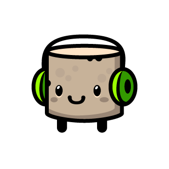

# 50 Deaths

50 Deaths is a short rogue-like game where you fight your way through multiple levels and eventually beat the final boss! (Hopefully you don't actually need 50 deaths to finish the game!)

[Video Demo](https://youtu.be/AAngr3Ti0kc)!

It is built with Lua [LÖVE Framework](https://love2d.org/), a 2D game framework.

The version used while developing this game is LOVE 11.4 (Mysterious Mysteries).

Detailed below are both gameplay details and implementation details, along with the rationale behind some of the design choices.

This game is built as a final project for CS50: Intro to Game Development. There is no commit history because this was developed in another repository!

## Starting the Game

After launching the game, the player can select "Play" from the Start screen to start playing the game. Otherwise, they can select "Quit" from the Start screen to quit the game.

The player will control these selections via the Up and Down arrow keys and press `enter` to choose the selected option.

## Scoring

There is a simple scoring system in this game.

The score is displayed on the top right of the screen during the play state.

The score will increment upon slaying monsters and progressing through levels. As the game progresses, the score gained will increase too.

This score is displayed again on the Game Over screen.

## Levels

There are a total of 5 randomly generated levels and 1 final boss level for the player to fight through. Upon killing all enemies in the level, the player will [transition](#level-transition) to the next level.

### Level Generation

A level consists of multiple rows of tiles and enemies.

In every row of tiles, there will always be at least 1 gap between the tiles. There are also 2 additional constraints on the tile gap spawning:
1. Tile gap size is at least 2.
2. Tile gaps will never spawn directly on top of the previous row of tile's gaps (i.e. there will never be 2 consecutive gaps, vertically).

Normally, you would not be able to jump onto the next row of tiles but the level generation ensures that there is always a [jump potion](#jump-potion) underneath the gap that provides sufficient jump power to do so.

Tile textures are generated such that each row of tiles will have similar colours but with slight variations.

Enemies have a 1 in 10 chance to generate on a tile. Each type of enemy has an equal chance to spawn. However, there is an additional safe zone around the player spawn point that ensures that no enemies will spawn there (for fairness).

### Level Transition

After clearing a level of all the enemies, the player will be given 3 seconds to move around (and pick up any potions, should they wish to) before being sent to the transition screen to transition over to the next level. During these 3 seconds, a "Level Cleared" text will appear in the background.

After each level, the player will receive boosts to their stats. This includes their maximum hit points, movement speed, melee damage, ranged damage, ranged speed and ranged distance.

After 5 regular levels, the game will transition into the [Boss Level](#boss-level) next.

### Boss Level

The Boss Level's generation is similar to regular level generation but much simpler and only consists of a single row of tiles and the [boss](#final-boss) itself.

## Hero

You are the Hero! Go slay some monsters!

### Health

The Hero initially has 5 maximum hit points and starts with 5 hit points. The player gains 1 maximum hit point after every level and is effectively healed by 1 hit point (because of the increase in maximum hit points).

Red heart represents hearts that the player current has. Greyed out hearts represent hearts that are lost, out of the maximum hit points. These hearts are rendered at the top left of the screen.

After the Hero takes damage, the Hero will turn invulnerable (indicated by flashing) momentarily. Furthermore, the hearts will also flash.

Note that despite the health being displayed in full hearts, in reality, the hit points are floating point values because damage dealt is not necessarily integer values. Thus, the number of red hearts rendered is actually the mathematical ceiling of the actual hit points the player has. However, this does not affect gameplay much.

### Movement

Keypress: Left & Right arrow keys to move left & right. Up arrow key to jump.

The player can only jump when on the ground (naturally).

The Hero has gravity acting on him, with proper acceleration. The detection is done simply by checking the nearest 2 tiles below him and checking if the Hero is colliding with either of them, with a vertical leeway. This collision detection is done by taking the usual AABB collision detection method and extending it to take in a horizontal and vertical leeway, this function `DoesCollide(a, b, leewayX, leewayY)` is found in [`Util.lua`](./src/Util.lua). The checks to ensure that the player doesn't go through the ceiling when jumping is also done similarly.

### Melee Attack

Keypress: `z`

The Hero's melee attack is his Wind Punch. The Hero will punch the air in front of him, dealing damage to anything there.

Additionally, the Hero can destroy enemy projectiles with this attack. However, the timing is fairly hard to achieve (intentionally).

Melee attack does more damage than ranged attack!

The damage of this attack increases as the game progresses.

Hitbox:
* width: half of Hero (but additionally extends into the Hero a bit, to allow for the Hero to hit monsters inside him)
* height: same as Hero

There is a "wind-like" sound effect played when punching.

The hitbox is only checked once, at the very start of the attack animation, which is why timing the destruction of projectiles is so difficult.

### Ranged Attack

Keypress: `x`

The Hero's ranged attack is a Fireball. This Fireball travels a certain distance before dissipating. If the Fireball hits a monster, it will deal damage to that monster and instantly disappear.

Ranged attack does less damage than melee attack, but has other clear advantages.

The damage, speed and range of this attack increases as the game progresses.

Hitbox:
* width: half of Hero
* height: half of Hero

There is a "fireball" sound effect played when punching.

## Monsters

There are 3 different types of regular monsters and 1 final boss, all with very different movesets.

After a monster takes damage, they will flash red and there will be a sound effect played.

Monsters deal collision damage to the Hero, but not vice versa, so be careful!

### Marshmallow

Marshmallow is the simplest monster and will simply sit there and look at the player (while jamming to some music).

Don't be fooled by its soft-looking exterior, it does a lot of collision damage!

Marshmallow's hit points and collision damage scales as the game progresses.

### Carrot

Nobody really knows why, but Carrot is perpetually angry.

Additionally, it gets really angry and starts shooting bits of itself at the Hero if the Hero gets near it. Note that the disengagement radius is further than the engagement radius, so you have to get really far away before it stops firing! To make things worse, Carrot boasts the most hit points out of the 3. Thankfully, it's a carrot, so it can't move.

Carrot's hit points, engagement radius, disengagement radius, projectile speed, projectile distance scales as the game progresses.

### Ghost

Ghost's favourite pastime is hunting heroes.

Ghost will patrol back and forth within a certain patrol radius, seeking its prey. When it detects a Hero nearby, it will increase its speed and rush towards the Hero. Additionally, Ghost cannot be hurt by projectiles, the Hero has to get real close and hit it with his Wind Punch to deal damage!

To make up for it, the Ghost has the lowest hit points out of the 3 and can be typically killed in a single melee attack.

Ghost's hit points, patrol movement speed, attack movement speed and patrol radius scales as the game progresses.

### Final Boss

Spoilers!

The real final boss is yourself!

The final boss is essentially a (much) bigger version of the Hero, so it has moves similar to the Hero.

Once the fight starts, the Boss will continuously track and move towards the Hero. When the Boss is sufficiently close enough to the Hero, the Boss will fire (massive) fireballs at the Hero.

Boss's hit points are shown on the screen via a health bar!

The Boss has really high hit points, but is definitely beatable!

Beat the Boss to beat 50 Deaths!

## Potions

Potions oscillate up & down on the floor and await the player to pick them up. There are various different potions, each are detailed below.

The player can pick them up by simply walking into them. Reusable potions will not disappear after applying its effect on the player.

### Jump Potion

Jump potions naturally generate on the floor to help the player reach the next row of tiles.

This potion raises the jump height of the player from 2 to 5 tiles.

Jump potions are reusable!

### Health Potion

Health potions have a 1 in 6 chance to spawn after an enemy dies.

This potion heals the player by 2 hit points.

### Speed Potion

Speed potions have a 1 in 3 chance to spawn after an enemy dies.

This potion increases the player's movement speed by 1.5 times.

## Game Over

After the Hero dies, or the Boss dies, the game will transition to the "Game Over" state. Here, the player's score will be rendered onto the screen and they can press `enter` to restart the game.

The text rendered on the screen is also different depending on if the player beat the game or not.

## Misc

### Entities & Effects

Entities have an effect system that makes it very easy to temporarily modify their fields. After the duration of the effect, the field will automatically revert back to its original value (or another provided value) and triggers an optional callback function at the same time.

Futhermore, effects attached to the Hero are rendered on the top right of the screen.

Implementing this simple system made adding effects onto the Hero and monsters very easy.

### Pausing & Quitting

Keypress: `p`

Fighting monsters can be tough and you might need to catch your breath halfway through. Just hit `p` to pause and unpause the game at any time during the play state. There will be 3 seconds between clicking unpause and the game actually continuing, with a simple countdown on the screen.

From the Paused Screen, the player can also hit `q` to quit the game.

### Debug Mode

You can turn on debug mode by changing the `DEBUG_MODE` flag at the top of `main.lua` to `true`. This will display the hitboxes of (most) things in the game, which is great for debugging! Also, when in debug mode, click `esc` key at any point in the game to close the game.

Additionally, there is also a `SPEED_HACK` flag, if you ever want to feel like a speed demon.

### Game States

These are the game states used in the game.

1. Start State
2. Play State (the main state!)
3. Level Transition State (transition state between levels)
4. Game Over State (hopefully you only see this after winning!)
5. Pause State
6. Continue State (from pause)

## Credits

### Game Logic

The files listed here are adapted and extended from some of the previous CS50G assignments. So, I do not take credit for most of the code in these files.

1. main.lua
2. Util.lua
3. Animation.lua (modified slightly to fit my needs)
4. StateStack.lua
5. StateMachine.lua
6. BaseState.lua
7. EntityBaseState.lua
8. Entity.lua (added [effects system](#entities--effects) & hp functions)

### Lua Libraries

These are the libraries used for this game!

1. Push: https://github.com/Ulydev/push
2. Class: https://github.com/vrld/hump/blob/master/class.lua
3. Timer: https://github.com/airstruck/knife/blob/master/knife/timer.lua

### Graphics

Roguelike Tiles (large collection)
* Made by: David E. Gervais
* Found at: https://opengameart.org/content/roguelike-tiles-large-collection
* Used for ground.

Gentleman Spy [Animated]
* Made by: DezrasDragons
* Found at: https://opengameart.org/content/gentleman-spy-animated
* Used for hero.

Potions
* Made by: Rafaelchm
* Found at: https://opengameart.org/content/potion-bottles
* Used for various potions.

Fireball
* Made by: ScagHound
* Found at: https://opengameart.org/content/fireball-flying-through-the-air
* Used for ranged attack.

Monsters
* Made by: bevouliin.com
* Found at: https://bevouliin.com/
* Used for Carrot, Ghost, Marshmallow enemies.

Hearts
* Made by: Dansevenstar
* Found at: https://opengameart.org/content/heart-pixel-art
* Used for Hero Health.
* Modified for Broken Health texture.

### Fonts

Rubber Biscuit Bold
* Made by: dibujado/dabnotu
* Found at: https://www.1001fonts.com/rubber-biscuit-font.html
* Used as title font.

SF Atarian System Regular
* Made by: ShyFonts Type Foundry
* Found at: https://www.1001fonts.com/sf-atarian-system-font.html
* Used as the default font throughout the game.

### Sounds

Player jumping in a video game
* Made by: mixkit
* Found at: https://mixkit.co/free-sound-effects/jump/
* Used for jump sound effect.

Jump Landing Sound
* Made by: MentalSanityOff
* Found at: https://opengameart.org/content/jump-landing-sound
* Used for jump landing sound effect.

Spell 4 (Fire)
* Made by: Bart K.
* Found at: https://opengameart.org/content/spell-4-fire
* Used for fireball sound effect.

Select 1
* Made by: Triangle Ace Studio
* Found at: https://opengameart.org/content/select-1
* Used for menu selection sound effect.

Windy sound 2
* Made by: Arthur
* Found at: https://opengameart.org/content/windy-sound-2
* Used for punch sound effect.

Hit sound bitcrush
* Made by: DaGameKnower
* Found at: https://opengameart.org/content/hit-sound-bitcrush
* Used for hit sound effect.
